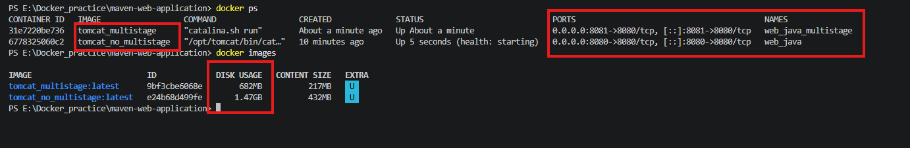
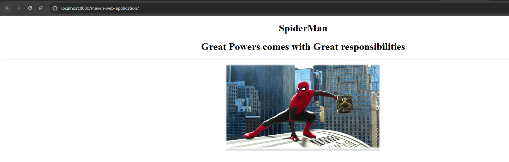
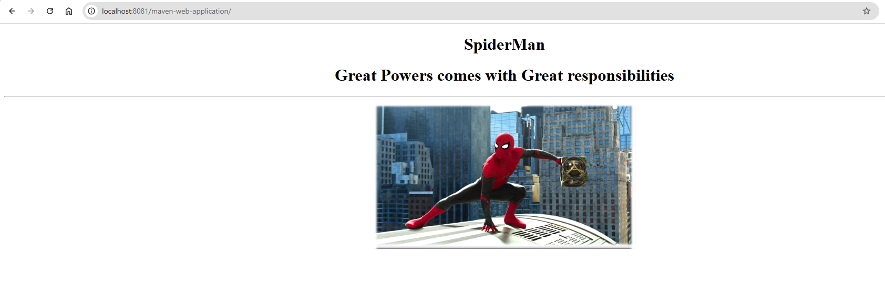

## Here we can learn how to work with docker multistage builds using this java-maven code. Basically it is using the tomcat for deployment

# What is a Multi-Stage Docker Build?

* A multi-stage Docker build uses multiple FROM statements in one Dockerfile.

** The main idea is: **

Use one image to build your application, and a smaller image to run it.

By using the Multi-Stage Docker build we can reduce the size of image. you can check this below screenshots and most important if we use the final base image (Distroless images) it will improve the security.

# What are Distroless Images?

* Distroless Docker images are minimal container images that contain only the application and the runtime dependencies needed to run it.

